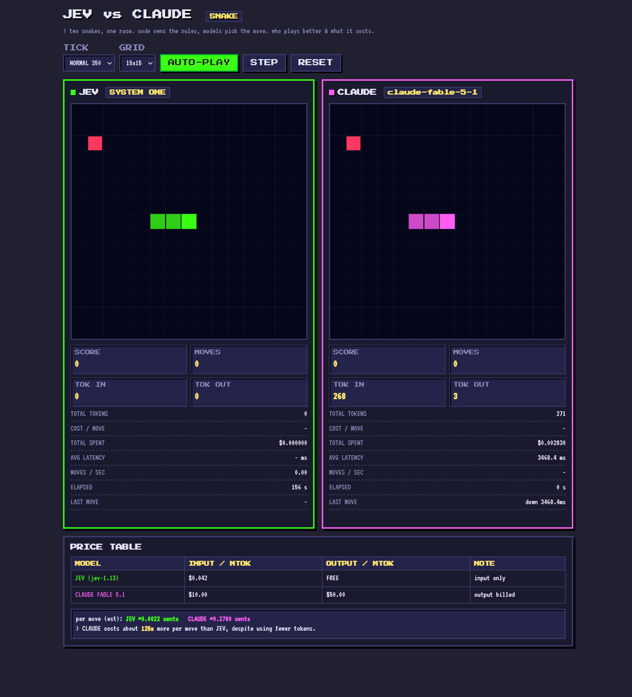

# Jev vs Claude — Snake

A pixel-themed Snake game where three models race side by side:

- **Jev** — TypeSafe's System One decision model (`jev-latest`), called via the TypeSafe API.
- **Claude Fable 5.1** — called via **Azure AI Foundry** (Anthropic messages API at an Azure endpoint).
- **Laya** — a self-hosted System One model ([convaiinnovations/laya](https://huggingface.co/convaiinnovations/laya)) running locally on your GPU via `laya/server.py`.

Code owns the game rules (grid, collisions, legal-move filtering, timing). Each model only picks the next direction from the **legal, non-fatal moves** — it never gets the chance to pick a move that would instantly kill the snake. The app then measures **latency**, **token usage**, and **cost** for every move so you can compare the two models on the same task.

 



---

## Why this exists

Jev is a **System One** model: it returns fast, *typed* judgments (a `Choice` over `up/down/left/right` with a probability distribution and confidence) — not generated text. Claude is a generative LLM that outputs a single word.

This app makes the tradeoff concrete:

- **Speed** — Jev answers in ~1s/move; Claude Fable 5.1 in ~7s/move. Each snake runs on its own loop and moves the instant its model answers, so you watch Jev race ahead.
- **Tokens** — Jev uses *more* tokens per move (richer structured request + full probability output) than Claude's one-word reply.
- **Cost** — but Jev bills **input only (output is free)** at **$0.042/Mtok**, while Claude Fable 5.1 is priced far higher (per Anthropic's pricing page; adjust in `.env` to match your Azure bill). **Laya is self-hosted, so it's $0**. Net result: **Jev is dramatically cheaper per move than Claude — often hundreds of times cheaper — despite using more tokens, and Laya is free.** The exact multiplier depends on your configured prices and is shown live in the on-page price table (see screenshot above).

---

## How it works

```
browser (pixel UI, two canvases)
        │  POST { snake, food, direction, size }
        ▼
server.js  ──► /api/move        ──► TypeSafe API  (Jev, Choice question)
         └─► /api/move-claude ──► Azure AI Foundry (Claude, messages API)
```

For each move, the server:

1. Computes the **legal, non-reversing, non-fatal moves** in code (the model never sees an impossible option).
2. Sends the board (as a text grid) plus the legal options to the model.
3. Applies the model's chosen direction and returns **direction, confidence, latency, token usage, and cost**.

If only one legal move exists, the server takes it directly and spends **0 tokens** — deterministic cases stay in code, per the TypeSafe skill's guidance.

---

## Setup

Requires Node.js 20+.

```bash
npm install
```

Create a `.env` (gitignored — never commit it):

```ini
# TypeSafe (Jev)
TYPESAFE_API_KEY=apikey_...

# Azure AI Foundry hosting Claude
# The endpoint may omit the https:// scheme; the app adds it and appends /v1/messages if needed.
AZURE_ENDPOINT=cytos-ai-dev-fndry.services.ai.azure.com/anthropic/v1/messages
AZURE_API_KEY=...
AZURE_MODEL=claude-fable-5-1

# Pricing (USD per million tokens) for the live cost analysis.
# Jev bills INPUT ONLY (output is free). Claude Fable 5.1 per Anthropic's pricing page.
# Laya is self-hosted -> always $0 (no env var needed).
JEV_PRICE_IN_PER_MTOK=0.042
JEV_PRICE_OUT_PER_MTOK=0
CLAUDE_PRICE_IN_PER_MTOK=10
CLAUDE_PRICE_OUT_PER_MTOK=50

# Optional: override the local Laya server URL (default below).
# LAYA_URL=http://127.0.0.1:8000/predict
```

**Laya snake (optional):** to enable the third snake, start the local Laya server — see [`laya/README.md`](laya/README.md). Without it, the Laya panel shows an error but the Jev and Claude snakes still run.

Run:

```bash
npm start
```

Open <http://localhost:3000>.

---

## Using it

- **AUTO-PLAY** — starts both snakes; each moves at its own model's speed (no waiting). Click again to stop.
- **STEP** — one move for both (useful to inspect a single decision).
- **RESET** — new board; both snakes start from the *identical* snake + food for a fair race.
- **TICK / GRID** — speed and board size.
- Arrows / WASD also work for manual play.

Each panel shows: score, moves, tokens in/out, total tokens, **cost per move**, **total spent**, avg latency, moves/sec, elapsed, and the last decision (with confidence for Jev).

The **PRICE TABLE** card reads `/api/pricing` and shows a live per-move cost estimate and the multiplier between the two models.

---

## Configuration notes

- **Azure auth**: Azure AI Foundry's Anthropic endpoint uses `Authorization: Bearer <key>`, not `api-key`. The server sends the bearer header and `anthropic-version: 2023-06-01`.
- **Claude output**: a system prompt forces single-word output (`up`/`down`/`left`/`right`) to keep it from reasoning out loud and burning tokens. The parser takes the last legal direction word in the reply, with a fallback to the first legal move.
- **Pricing**: adjust the `*_PRICE_*` env vars to match your actual Azure bill if it differs from Anthropic's list price.

---

## Project layout

```
server.js          Express server: /api/move, /api/move-claude, /api/move-laya, /api/pricing
public/index.html  Pixel-themed UI, three Snake games, price table
laya/server.py     Local Laya inference server (Python, runs on GPU)
.env               (gitignored) keys + pricing
.agents/skills/    TypeSafe agent skill (installed via `npx skills add`)
```

---

## Notes & caveats

- Jev is a **judgment model, not a pathfinder** — it reads the board and picks a plausible direction, but it doesn't plan ahead. It will eventually trap itself. That's the point of the demo: you see the real quality and cost of a System One judgment driving a game loop.
- The "same input" guarantee holds for the **starting board**; the two boards diverge once the models choose differently, because keeping them identical every move would require waiting (which defeats the speed comparison).
- Token counts come from each provider's `usage` field; cost is computed server-side from the configured prices.

---

## License

MIT for the app code. The bundled TypeSafe skill under `.agents/skills/typesafe-ai/` retains its own license.
